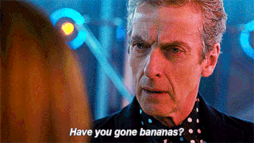
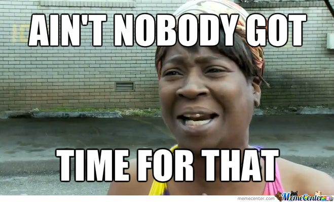

# 🐾 "Have You Fed The Cat?" – Project Roadmap

A humble attempt to bring peace and order to the chaotic feeding habits of small domestic tyrants (also known as cats). I can't do much about "What shall we have for dinner tonight?" but I can put a dent in the omnipresent "Have you fed the cat?"

This started as a simple “have they been fed?” tracker and is now evolving into a full-blown data-driven system for monitoring the nutritional manipulation tactics of my household fur-babies.

---

## ✅ MVP – The Basics (v1.0)

- [x] Log when a cat’s been fed
- [x] Record who did the feeding (blame accountability)
- [x] Optional notes (“with meds”, “refused wet food”, “ate like a goblin”)
- [x] View recent feedings in a nice, readable table
- [ ] See “last fed” summary for each cat

---

## 🔜 Next Steps (v1.1 – v1.2)

- [ ] Make it pretty! I'll add some styling and think about UX concerns
- [ ] Add basic stats (e.g. who feeds the most, how often they beg, who eats the most)
- [ ] Filter log by individual claw-floof
- [ ] CSV export (for those who want a spreadsheet of shame)
- [ ] Make the whole thing look decent on mobile
- [ ] Login and user sign up to stop freeloading housemates fiddling with the log

---

## 🫦 Mid-Term Plans – The *Really* Fun Stuff

- [ ] Raspberry Pi integration via IFTTT
  - A physical button near each food bowl to log a feed - How would this log the feeder? AI assisted camera?
  - A tiny display showing when each cat was last fed
  - Optional “You just ate, mate” LED warning system

- [ ] Add “attempted manipulation” logging
  - e.g. “Tango looked mournful at 3:14 PM”
  - Stats on when the guilt-trip eyes are most commonly deployed

- [ ] Build a “cat hustle heatmap” to track peak begging hours
  - Use it to optimise real feeding times
  - Reduce meowing, "The Paw", pleading eyes, and unnecessary guilt

- [ ] Notifications
  - “Marmite hasn’t been fed in 6 hours”
  - “Tango is lying. He was just fed.”

---

## 🍌 Long-Term & Wild Ideas

- [ ] Make it a PWA or mobile app
- [ ] Voice assistant integration
  - “Alexa, I fed Marmite”
  - “OK, logging a feed and updating the shame chart”

- [ ] QR code next to each bowl for quick log from your phone
- [ ] Medication tracking (e.g. “gave half tablet with wet food”)
- [ ] Weekly reports (“Marmite ate 14 times, begged 36 times – efficiency 30.92%”)

---
## 😫 Staaaahp! This is supposed to be a simple  project!

- [ ] Hook up AI powered camera to track which cat eats what (oak d-lite cam coupled with Raspberry Pi & Python)
- [ ] Or (simpler than above but requires collars), use rfid collar dongle to track cat ID
- [ ] Weigh the bowls to track food quantities
---
## 🧠 Philosophy

1. **Track what actually happened**, not what the cat *says* happened.
2. **Make feeding transparent**, especially in households with multiple human underlings.
3. **Use data to outwit manipulation** (or at least feel slightly less gaslit by the floofs).

---

